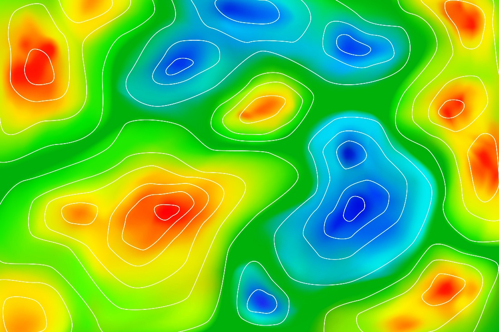

# **Unidad 4. Cartografia de suelos** {-} 

---

<h3 style= "color: green"> Cartografía convencional de suelos</h3>

---

Los diferentes procesos físicos, químicos y biológicos que han dado origen al suelo han causado la variación de sus características tanto en profundidad (con capas u horizontes diferentes) como en sentido lateral, La necesidad de comprender la variabilidad espacial de las propiedades edáficas hace absolutamente necesario aplicar un enfoque geográfico al estudio del suelo. La geografía de suelos se describe principalmente por medio de mapas, que permiten predecir las propiedades del suelo en los sitios o áreas de interés, a partir de
los datos obtenidos en puntos de muestreo. Este tema describe las bases conceptuales y procedimientos aplicados convencionalmente para producir mapas de suelos.

### Variabilidad Espacial y Cartografía de Suelos {-}

###### _Clase 1_ : Necesidad de conocer como son las carateristicas, limitaciones y potencialidaes de los suelos, mediante la creación de mapas. {-}

<!--  -->

---

### Cartografía Convencional de Suelos {-}

###### _Clase 2_: Fundamentos de la cartografía convencional de los suelos. {-}

---

### Levantamiento Convencional de Suelos {-}

###### _Clase 3_: Levantamiento de suelos, Unidades taxonómicas y cartográficas, Escala del mapa de suelos, Tipos de levantamiento de suelos, Leyenda del mapa de suelos, Suelos similares y disimiles, Tipos de unidades cartográficas, Control de calidad del mapa de suelos y Objeciones al enfoque convencional de cartografía de suelos. {-}

---

<h3 style= "color: green"> Cartografía digital de suelos</h3>

---

Los cambios tecnológicos generados por el desarrollo de la informática han tenido un profundo impacto sobre la caracterización del suelo en los puntos de muestreo y la predicción de las propiedades edáficas en sitios no muestreados. Estos cambios tecnológicos incluyen, por ejemplo: 1) instrumentos de detección proximal del suelo; 2) modelos digitales de elevación, LiDAR y datos de percepción remota, que han potenciado la capacidad para comparar la variación espacial del suelo, con la  de otras variables ambientales; 3) métodos numéricos que permiten modelar, cuantitativamente, la variabilidad espacial del suelo con apoyo de variables ambientales auxiliares. Estos cambios tecnológicos han conducido al desarrollo de la cartografía digital del suelo.  Este tema presenta los fundamentos de este nuevo enfoque de mapeo del suelo, los procedimientos aplicados con más frecuencia, y su relación con el mapeo convencional de suelos. La relación de este tema con los otros temas del diplomado es fundamental, porque sin una base adecuada de conocimientos sobre génesis de suelo y su relación con el paisaje, el mapeo digital del suelo puede conducir a cometer errores cartográficos graves, que posiblemente queden encubiertos por vistosas presentaciones de mapas.

### Cartografía Digital de Suelos {-}

###### _Clase 3_: Fundamentos de la cartografía digital aplicada a los suelos. {-}

